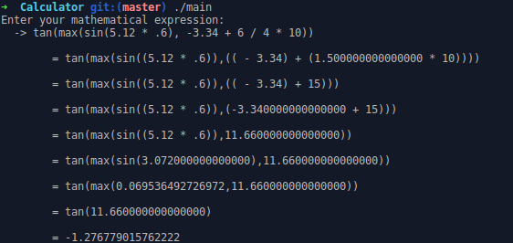

# Calculator

A simple calculator that evaluates a mathematical expression and shows the
step by step solutions.

## EXAMPLE
For example to evaluate the expression: `tan(max(sin(5.12 * .6), -3.34 + 6 / 4 * 10))`

Note: You can use any type of numbers - **integers** (like 3 10 -40) or **reals** (like 23.45 .12 78e+23 12.34E56) -

## SUPPORTED OPERATORS AND FUNCTIONS

**Mathematic operators**:
  * `+` (addition), `-` (subtraction), `*` (multiplication),
  * `/` (division), `^` (exponentiation), `%` (modulo)

**Numeric functions**:
  * `min` - The smallest of two numbers
  * `max` - The largest of two numbers

**Mathematic functions**:
  * `sin` (sine), `cos` (cosine), `tan` (tangent)
  * `sqrt` (square root), `abs` (absolute value), `ln` (natual logarithm)

## LICENSE

MIT © 2017 Mohcine EL KASSIB